# Project report for the CG 100433 course

## Project Title

The North Sea Mirage

## Team member

- 陈宏明
- 陈骁
- 贾俊杰
- 马昕岳
- 王上游
- 王耀辉
- 吴芳昊

## Abstract

我们的灵感来自于一些影视作品中的奇幻场景，在这个场景中，夜色下的大海，漂浮着一艘小船，闪烁着荧光的鱼群伴着小船在空中游动，给人以如同置身梦境的奇妙体验。

在本次的项目中，主要分为了

1.船的内外模型

2.鱼的模型与游动效果；

3.水的动态效果与船底波纹三个部分。

为了实现这些效果，我们小组学习并实践了模型导入、骨骼动画、粒子技术、PBR渲染、帧缓冲、水的数学模拟、uv动画等多种技术，最终成功实现预期效果。

## Motivation

- 我们都接触过相关的奇幻影⽚场⾯，对其中梦幻的场景感到惊艳
  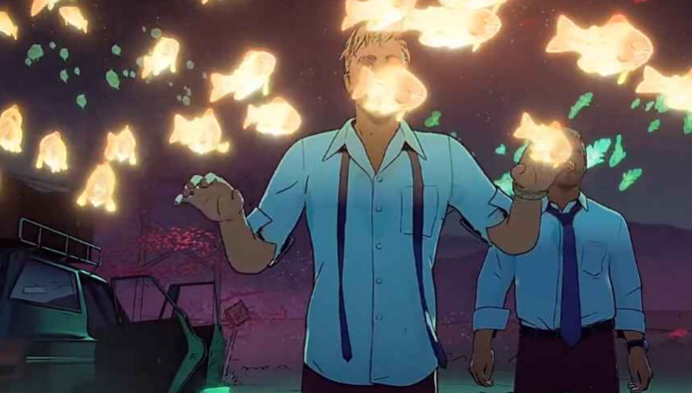
- OpenGL相关的资料中有较多关于⽔的内容，光照变换也很丰富，可以导⼊⼀些模型

## The Goal of the project

- 导入船的模型，产⽣较为真实的材质效果
- 实现对海洋的⼤型⽔体渲染，⽔体为动态⽔体，可以产⽣真实的光照效果
- 将环境光源和⽔体交互，产⽣折射、反射等真实的⽔⾯视觉效果
- 导入鱼的模型，实现幽灵⻥的材质渲染，粒⼦效果，在⽔下⽔⾯的光照变换

## The Scope of the project

- 追求对场景的真实实现
- 实现粒⼦效果
- 实现鱼的骨骼动画效果
- 不做物理碰撞检测
- 不做⽔⾯雾化效果
- 天空和远景是固定贴图不可交互
- 场景范围有限

## Involved CG techniques

<!Describe the techniques used in your project. and explain them briefly. >

### 水体渲染技术

- 水面模拟：用正方形作为Water的原型，在多个正弦波的叠加下，在正方形不同位置计算正弦函数获得不同的高度和法向量，模拟水面波浪效果
- 水面反射：通过改变view矩阵，即改变camera位置和视野，以水面为裁减平面，把场景渲染为反射帖图，投影到水面上。在渲染反射帖图时，需要以水平面为参考面，把摄像机镜像翻转到水面之下。
- 水面折射：通过在原本场景的基础上记录水面下物体的depth-framebuffer,并在渲染时按照深度减淡颜色和一定的位置偏移
- 混合（Blending）：使用混合来将折射framebuffer与反射framebuffer融合，实现水上水下效果。

### Framebuffer

- 通过自己定制的framebuffer画出不同的物体折射与反射效果，然后在默认的framebuffer上把这两个framebuffer当做texture来进行混合，最终画出整个水面上的反射与水面下的折射效果。

### uv动画

- 按照时间和偏移量的不同动态更新uv贴图，实动态的水波纹效果。

### 船体实现

* 使用assimp导入obj文件实现对船体内部和外部的导入，需要对船体模型作出修改，并对mtl文件作出必要的编辑
* 使用混合(Blending)实现船体玻璃的材质效果

### 鱼类骨骼动画

- 使用骨骼动画技术完成鱼类的游动动作效果
- 筛选了大量模型，并通过blender和3DSmax对骨骼动画进行了修改和调整以符合我们需求

### 鱼类荧光效果

- 研究高斯模糊和帧缓冲是为了达到边缘有一层光晕的效果，之后通过调整这个光晕的颜色来模拟荧光的效果

### 鱼类移动效果

- 通过构造游动函数来控制鱼游动的速度，上下起伏的程度和频率和位置等等。主要操纵模型的位置矩阵，对其进行一系列平移，旋转等矩阵变换，同时以时间作为参数，巧妙地选取了三角函数这样有周期的函数，通过时间差和各项参数，用统一的方法来实现每条鱼不同的运动姿态。

### 粒子效果

- 粒子发射器生成粒子，持续不断生成新的微粒，粒子会有一个生命值变量，从产生开始缓慢减少，少于某个极限值就会杀死该粒子

## Project contents

- 成功导入船的模型，产⽣较为真实的材质效果
- 成功实现对海洋的⼤型⽔体渲染，⽔体为动态⽔体，可以产⽣真实的光照效果
- 成功将环境光源和⽔体交互，产⽣了折射、反射等真实的⽔⾯视觉效果
- 成功导入鱼的模型，实现幽灵⻥的材质渲染，在⽔下⽔⾯的光照变换
- 成功加载骨骼动画，鱼类效果可移动
- 成功在船体添加粒⼦效果，实现场景全动态
- 成功实现水体波纹效果，并添加边缘虚化


## Implementation

### 水体渲染

- 水面叠加的正弦波

  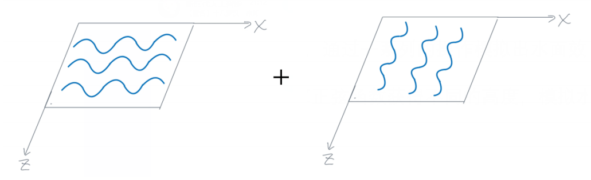

  ```glsl
  // 对x和y取不同频率的正弦函数相乘形成正弦波，再叠加多个不同的正弦波形成水面效果
  float get_wave_0(float x, float y){
     x = x+time/100;
     y = y+time/100;
     float wave = sin(x*64*3.1415)*sin(y*16*3.1415);
     wave = wave/2;
     wave = wave*0.01;
     wave += (sin((x+0.23-time/200)*64*3.1415)*sin((y+0.76+time/200)*128*3.1415))/2*0.001;
     wave += (sin((x+0.7664+time/50)*128*3.1415)*sin((y+0.2346-time/50)*128*3.1415))/2*0.0005;
     return wave;
  }

  // 另外一种叠加形成的不同wave
  // a*sin(d*(x,y)*w+t*phi)
  float get_wave_1(float x, float y){
     float wave = 0.01*sin( dot(normalize(vec2(1,0)), vec2(x, y)) *128+time);
     wave += 0.01*sin( dot(normalize(vec2(15,1)), vec2(x, y)) *128+time);
     wave += 0.01*sin( dot(normalize(vec2(10,-1)), vec2(x, y)) *256+time*1.5);
     wave += 0.01*sin( dot(normalize(vec2(3,1)), vec2(x, y)) *256+time*1.5);
     wave += 0.02*sin( dot(normalize(vec2(6,-1)), vec2(x, y)) *64+time*0.8);
     wave += 0.015*sin( dot(normalize(vec2(8,1)), vec2(x, y)) *128+time*0.7);
     return wave/12;
  }

  // 根据设置以选取不同的水面效果
  float get_wave(float x, float y){
     float wave = 0;
     if(water_effect == 0u){
        wave = get_wave_0(x, y);
     }
     else if(water_effect == 1u){
        wave = get_wave_1(x, y);
     }
     else if(water_effect == 2u){
        wave = 2*get_wave_0(x, y);
     }
     else if(water_effect == 3u){
        wave = 2*get_wave_1(x, y);
     }
     return wave;
  }
  ```
- 折射步骤

  ```c++
  //==============REFRACTION STEP
  //简单的按原本场景画到framebuffer中
  water.set_enabled(false); // dont display water in refraction
  framebuffer_refraction->bind();

  glClear(GL_COLOR_BUFFER_BIT);
  glClear(GL_DEPTH_BUFFER_BIT);

  for (size_t i = 0; i < lst_drawable.size(); i++)
  {
      lst_drawable[i]->draw();
  }

  framebuffer_refraction->unbind();

  depth_framebuffer->draw_fb(&lst_drawable);
  ```
- 反射步骤

  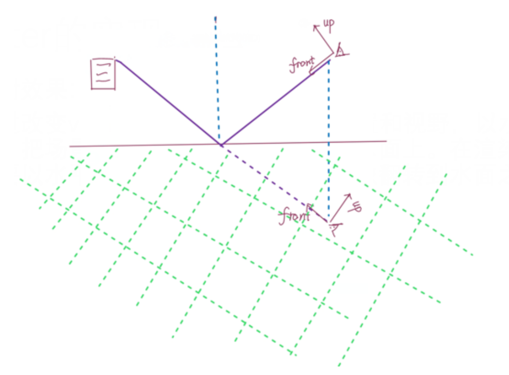

  ```c++

  //==============REFLEXION STEP
  //改变view矩阵后画到framebuffer上
  framebuffer_reflection->bind();
  //设置裁剪空间，防止水面以下物体被反射
  glEnable(GL_CLIP_DISTANCE0);

  glClear(GL_COLOR_BUFFER_BIT);
  glClear(GL_DEPTH_BUFFER_BIT);

  //这里使用了原本视角与水面对称的view矩阵，模拟反射时所看到的的水面效果
  for (size_t i = 0; i < 5; i++)
  {
      cube_base[i].set_MVP_matrices(cube_base_transf[i].get_matrix(), cam->get_reflection_matrix(2), projection_mat);
  }
  for (size_t i = 0; i < 2; i++)
  {
      cube_decoration[i].set_MVP_matrices(cube_decoration_transf[i].get_matrix(), cam->get_reflection_matrix(2), projection_mat);
      sphere_decoration[i].set_MVP_matrices(sphere_decoration_transf[i].get_matrix(), cam->get_reflection_matrix(2), projection_mat);
  }

  water.set_MVP_matrices(water_transf.get_matrix(), cam->get_reflection_matrix(2), projection_mat);

  for (size_t i = 0; i < lst_drawable.size(); i++)
  {
      lst_drawable[i]->draw();
  }

  glDisable(GL_CLIP_DISTANCE0);
  framebuffer_reflection->unbind();
  ```

### Framebuffer

- 混合步骤

  ```c++
  void draw(unsigned int effect_select)
  {
      glUseProgram(_pid);
      glBindVertexArray(_vao);
  	// 向shader传入uniform属性变量
      glUniform1ui(glGetUniformLocation(_pid, "effect_select"), effect_select);
      glUniform1f(glGetUniformLocation(_pid, "tex_width"), _width);
      glUniform1f(glGetUniformLocation(_pid, "tex_height"), _height);

      // 绑定 refract texture
      glActiveTexture(GL_TEXTURE0);
      glBindTexture(GL_TEXTURE_2D, _tex);
      GLuint tex_id = glGetUniformLocation(_pid, "tex");
      glUniform1i(tex_id, 0 /*GL_TEXTURE0*/);

      // 绑定 reflect texture
      glActiveTexture(GL_TEXTURE1);
      glBindTexture(GL_TEXTURE_2D, _ao_tex);
      tex_id = glGetUniformLocation(_pid, "ao_tex");
      glUniform1i(tex_id, 1 /*GL_TEXTURE1*/);

      // 绑定 depth texture
      glActiveTexture(GL_TEXTURE2);
      glBindTexture(GL_TEXTURE_2D, _depth_tex);
      tex_id = glGetUniformLocation(_pid, "depth_tex");
      glUniform1i(tex_id, 2 /*GL_TEXTURE1*/);

      // 一次性画出所有效果
      glDrawArrays(GL_TRIANGLE_STRIP, 0, 4);

      glBindTexture(GL_TEXTURE_2D, 0);
      glBindVertexArray(0);
      glUseProgram(0);
  }
  ```

### uv动画

- 动态贴图

  ```glsl
  //UV动画函数
  vec2 DelayOffsetUV(vec2 uv, float offset, float offset_y)//输入UV 和偏移量（x，y），外部变量控制速度，范围
  {
   float pi = 3.1415926536f;
   float sintime = sin(_Time * _Speed * pi + offset * 0.5f * pi);//余弦函数使UV来回移动,
   float u = (sintime + 1) * 0.5f * _WaveRange + (1 - _WaveRange);
   uv.x += u;
   vec4 noiseColor = texture(_NoiseTex, uv);
   uv.x +=_WaveRange*sin(noiseColor.r*_NoiseRange);
   uv.y += offset_y;
   return uv;  
  }

  ```

### 船体实现

* 船体内外模型导入

  ```c++
          glEnable(GL_DEPTH_TEST);
          // 加载模型
          model = glm::mat4(1.0f);
          updateModelMatrix(&model, glm::vec3(0.0f, 0.0f, 0.0f));
          model = glm::translate(model, glm::vec3(baseX, baseY, baseZ)); //调整位移
          model = glm::scale(model, glm::vec3(5.0f));	//调整大小

          boatShader.setMat4("model", model);
          boatModel.Draw(boatShader);
          //加载模型
          model = glm::mat4(1.0f);
          updateModelMatrix(&model, glm::vec3(0.0f, 0.0f, 0.0f));
          model = glm::translate(model, glm::vec3((baseX+0.4f), (baseY-1.1f), (baseZ+1.42f))); //调整位移
          model = glm::scale(model, glm::vec3(3.4f));	//调整大小

          boatShader.setMat4("model", model);
          indoorModel.Draw(boatShader);
  ```
* 船体玻璃效果

  ```c++
          std::map<float, glm::vec3> sorted;
          for (unsigned int i = 0; i < windows.size(); i++)//导入各块玻璃坐标
          {
              float distance = glm::length(camera.Position - windows[i]);
              sorted[distance] = windows[i];
          }
          blendingShader.setMat4("projection", projection);
          blendingShader.setMat4("view", camera.GetViewMatrix());
          glBindVertexArray(transparentVAO);
          glBindTexture(GL_TEXTURE_2D, transparentTexture);
          for (std::map<float, glm::vec3>::reverse_iterator it = sorted.rbegin(); it != sorted.rend(); ++it)//逆序划出（需要考虑玻璃的层次）
          {
              model = glm::mat4(1.0f);
              updateModelMatrix(&model, glm::vec3(0.0f, 0.0f, 0.0f));
              model = glm::translate(model, it->second);
              model = glm::scale(model, glm::vec3(0.2f));
              //model = glm::translate(model, lightPos);
              blendingShader.setMat4("model", model);
              glDrawArrays(GL_TRIANGLES, 0, 6);
          }

  ```

### 鱼类模型

- 现实存在的问题是鱼类模型格式的繁杂以及质量参差不齐，为了解决相关问题，主要通过3dsmax打开模型，检查其结构，有的模型是部分骨骼动画模型+部分静态模型，比如说鱼是动态的，但是鱼眼是一个单独的球体静态模型，这种模型无论是用fbx格式还是其他的格式，导入时都会出现报错，无法正常运行。我们的做法是删除一些附着的部件，然后重新用3dsmax进行一些多边形贴图。有一些模型过于精细，所以会很卡，我们用blender对其进行了简化。同时我们也利用图像技术对单一模型进行贴图重置，让鱼变得更加多彩。我们其实制作了多种能用的模型，最终考虑到整体视觉效果并未都在作品中呈现

模型与动画加载：

```c++
    Model fishModel("../Glitter/objects/new_fish/fish.fbx");
    Model fishModel_2("../Glitter/objects/new_fish/fish2.fbx");
    Model fishModel_3("../Glitter/objects/new_fish/fish3.fbx");
    Animation animation("../Glitter/objects/new_fish/fish.fbx", &fishModel);
    Animator animator(&animation);
```

播放动画

```c++
        currentFrame = static_cast<float>(glfwGetTime());
        deltaTime = currentFrame - lastFrame;
        lastFrame = currentFrame;
        // input

        processInput(window);
        animator.UpdateAnimation(deltaTime);
```

### 鱼类荧光

```c++
for (unsigned int i = 0; i < amount; i++)
        {
            glBindFramebuffer(GL_FRAMEBUFFER, pingpongFBO[horizontal]);
            shaderBlur.setInt("horizontal", horizontal);
            glBindTexture(GL_TEXTURE_2D, first_iteration ? colorBuffers[1] : pingpongColorbuffers[!horizontal]);  // bind texture of other framebuffer (or scene if first iteration)
            renderQuad();
            horizontal = !horizontal;
            if (first_iteration)
                first_iteration = false;
        }
```

### 粒子效果

以下是我们的粒子生成器，包括位置，角度，喷射速度，喷射量，扩散程度，颜色等都可以自定义

```c++
int newparticles = (int)(deltaTime * 10000.0);
        if (newparticles > (int)(0.016f * 10000.0))
            newparticles = (int)(0.016f * 10000.0);

        for (int i = 0; i < newparticles; i++) {
            int particleIndex = FindUnusedParticle();
            ParticlesContainer[particleIndex].life = 2.0f; // This particle will live 5 seconds.
            ParticlesContainer[particleIndex].pos = glm::vec3(0.8f, 6.5f, -0.8);

            float spread = 1.0f;
            glm::vec3 maindir = glm::vec3(5.0f, 4.0f, 0.0f);
            glm::vec3 randomdir = glm::vec3(
                (rand() % 2000 - 1000.0f) / 1000.0f,
                (rand() % 2000 - 1000.0f) / 1000.0f,
                (rand() % 2000 - 1000.0f) / 1000.0f
            );

            ParticlesContainer[particleIndex].speed = maindir + randomdir * spread;


            //generate a random color
            ParticlesContainer[particleIndex].r = rand() % 256;
            ParticlesContainer[particleIndex].g = rand() % 256;
            ParticlesContainer[particleIndex].b = rand() % 256;
            ParticlesContainer[particleIndex].a = (rand() % 256) / 3;

            ParticlesContainer[particleIndex].size = (rand() % 1000) / 2000.0f + 0.1f;
int ParticlesCount = 0;
        for (int i = 0; i < MaxParticles; i++) {

            Particle& p = ParticlesContainer[i]; // shortcut

            if (p.life > 0.0f) {

                // Decrease life
                p.life -= deltaTime;
                if (p.life > 0.0f) {

                    // Simulate simple physics : gravity only, no collisions
                    p.speed += glm::vec3(0.0f, -9.81f, 0.0f) * (float)deltaTime * 0.5f;
                    p.pos += p.speed * (float)deltaTime;
                    p.cameradistance = glm::length2(p.pos - camera.Position);
                    //ParticlesContainer[i].pos += glm::vec3(0.0f,10.0f, 0.0f) * (float)delta;

                    // Fill the GPU buffer
                    g_particule_position_size_data[4 * ParticlesCount + 0] = p.pos.x;
                    g_particule_position_size_data[4 * ParticlesCount + 1] = p.pos.y;
                    g_particule_position_size_data[4 * ParticlesCount + 2] = p.pos.z;

                    g_particule_position_size_data[4 * ParticlesCount + 3] = p.size;

                    g_particule_color_data[4 * ParticlesCount + 0] = p.r;
                    g_particule_color_data[4 * ParticlesCount + 1] = p.g;
                    g_particule_color_data[4 * ParticlesCount + 2] = p.b;
                    g_particule_color_data[4 * ParticlesCount + 3] = p.a;

                }
                else {
                    // Particles that just died will be put at the end of the buffer in SortParticles();
                    p.cameradistance = -1.0f;
                }

                ParticlesCount++;

            }
        }

        SortParticles();
```

### 鱼类移动

```c++
  glm::vec3 sin_(float angle, float speed, float height)
  {
      glm::vec3 pos;
      pos.x = 0;
      pos.y = height*sin(angle * speed / 180 * 3.14);
      pos.z = 0;

      return pos;
  } 

  //以下是鱼类实现举例
   ourShader.use();
        initModel(&ourShader);
        ourShader.setMat4("projection", projection);
        ourShader.setMat4("view", camera.GetViewMatrix());

        auto transforms = animator.GetFinalBoneMatrices();
        for (int i = 0; i < transforms.size(); ++i)
            ourShader.setMat4("finalBonesMatrices[" + std::to_string(i) + "]", transforms[i]);

         ourShader.setMat4("model", model);
        ////泛光收尾函数
        //glm::mat4 model = glm::mat4(1.0f);
        model = glm::mat4(1.0f);
        model = glm::translate(model, glm::vec3(0.0f, 1.0f, 0.0f)); // translate it down so it's at the center of the scene   
        model = glm::scale(model, glm::vec3(.1f, .1f, .1f));	// it's a bit too big for our scene, so scale it down  

        model = glm::translate(model, sin_(glfwGetTime() + 9, 100, 10));
        model = glm::translate(model, glm::vec3(200.8f, 0.0f, 20.0f));
        model = glm::translate(model, glm::vec3(-6 * glfwGetTime(), 0.0f, 0.0f));
        ourShader.setMat4("model", model);
        fishModel.Draw(ourShader);

```

## Results

<!Demonstrate your project >

### 水体展示

反射效果

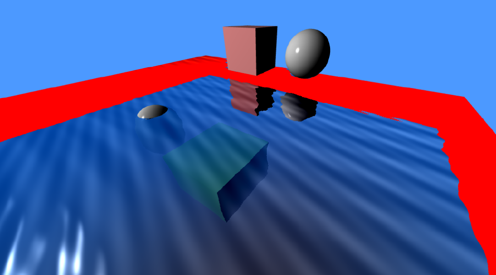

折射效果

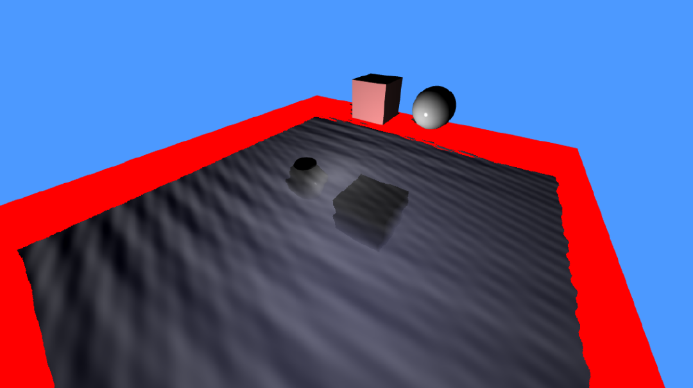

折射+反射混合效果

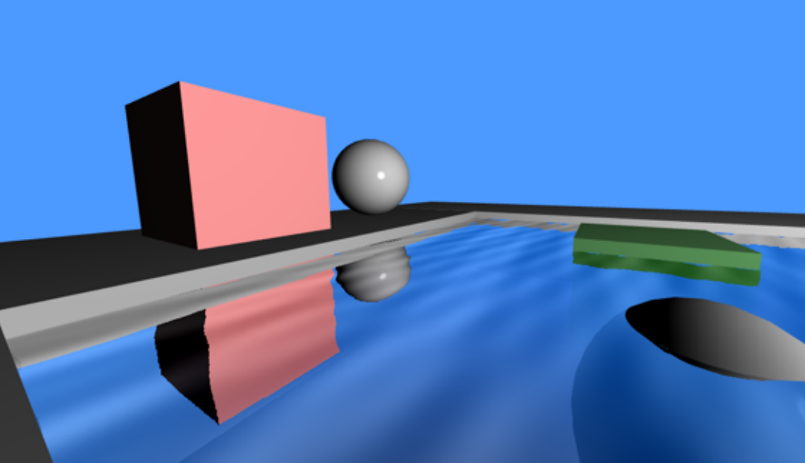

船底浪花效果

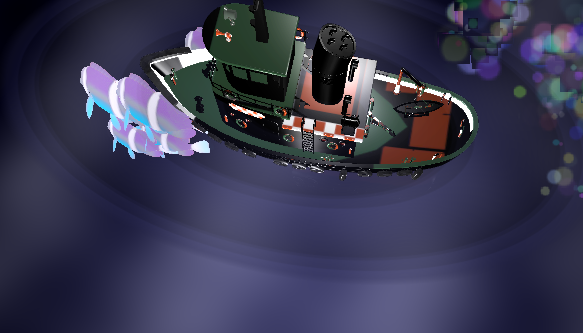

### 船体展示

船体外部建模效果

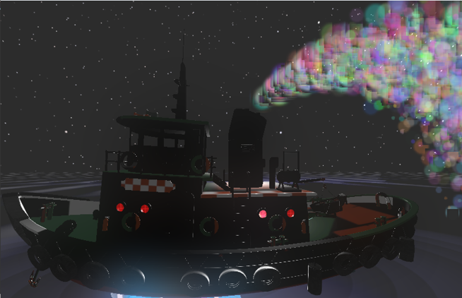

船体内部建模效果

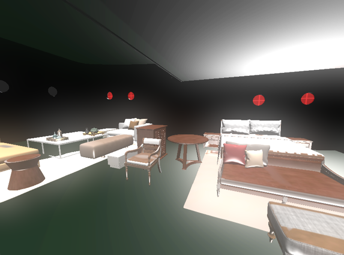

船体玻璃效果

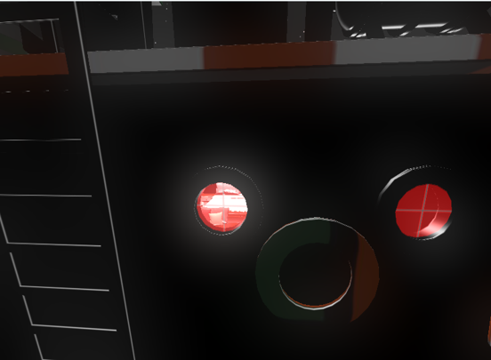

鱼类效果
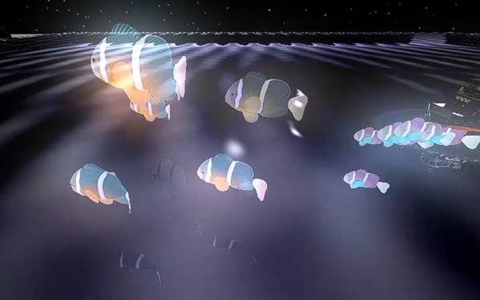

粒子效果
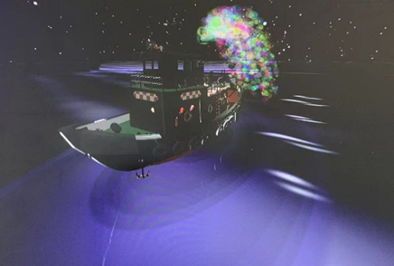

## Roles in group

Explain the distributions of the project contents.

各成员主要工作如下：

王耀辉：
代码整合，bug修复，整体进度推进
荧光与透明鱼制作，粒子效果添加，船模型导入(17.5%)                  

马昕岳：
灵感提出；骨骼鱼实现；鱼船动态效果；粒子效果调整；
拓展：天空盒添加；音乐效果；视频制作(16.5%)              

陈骁:
水面总负责；水面透射、反射效果；水代码整合，粒子bug修复；(16.5%) 

陈宏明：
水面折射、反射效果；参与代码整合，参与bug修复 (16.5%)     

吴芳昊：
实现船底波纹，完成边缘虚化，中期PPT (13.5%)            

贾俊杰：
船体,船体内部模型导入，窗户透光实现；期终ppt (13.5%)         
  
王上游：
船体模型导入，PBR研究(未成功)，阴影渲染(未成功) (6%)   


## References

Citations.

 https://github.com/damdoy/opengl_examples

 [ThinMatrix OpenGL Water Tutorials](https://www.youtube.com/watch?v=HusvGeEDU_U&list=PLRIWtICgwaX23jiqVByUs0bqhnalNTNZh)

https://learnopengl-cn.github.io/

## code
项目源码地址:https://github.com/wordqiong/ToyGL.git